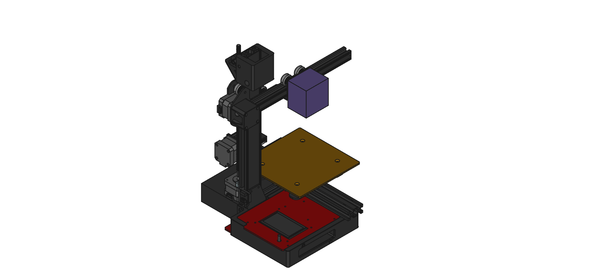

# Ender 2 Pocket Edition

Where size does matter, but smaller is better! This repo is the home of the ambitious project that took the beloved Ender 2 3D printer and shrunk it without using a magic wand or a trip through the dryer. 

Our mission? To make 3D printing as portable as your smartphone (okay, maybe not that small, but we’re getting there). 

Whether you're a hobbyist with a tiny desk or an astronaut looking for a printer that fits in a spacecraft, we've got you covered. Dive into the world of miniature engineering marvels, where every millimeter is celebrated, and discover how we're redefining the boundaries of compact printing. 

Warning: May cause a sudden urge to downsize everything else in your life.

